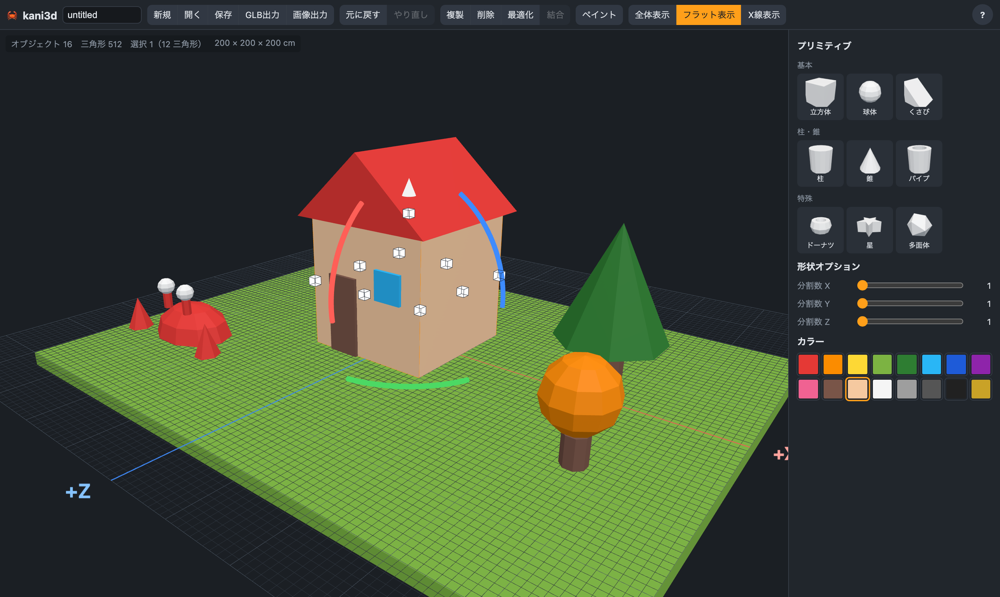

<div align="center">

# 🦀 kani3d

**積み木感覚で、ゲーム用のローポリモデルを作る Web 3D モデラー**

プリミティブを置いて、動かして、塗って、くっつけて、`.glb` で書き出す。

### [▶ ブラウザで試す](https://mimonelu.github.io/kani3d/)

[](LICENSE)




</div>

## ✨ 特長

| | |
|---|---|
| 🧱 **積み木のように置く** | 立方体・球体・くさび・柱・錐・パイプ・ドーナツ・星・多面体。クリックで追加、選択中なら上に積む、ドラッグで好きな場所へ |
| 🎛️ **形状オプション** | 角数・分割数・半球/半分・肉厚などを、置いたあとでも変更できる |
| 📐 **すべてスナップ** | 移動・拡縮は 5cm、回転は 45° 単位。Tinkercad 風の統合ハンドルで直感的に操作 |
| 🎨 **ポリゴン単位のペイント** | 16 色のパレットから、オブジェクト全体でも面 1 枚ずつでも塗れる（立方体は分割してマス目単位で） |
| 🔗 **結合と最適化** | CSG で 1 つのメッシュに結合し、同じ色・同じ平面の面をまとめて三角形を削減。結合解除・最適化解除も可能 |
| 🔍 **結合結果の検査** | 穴・内部面・裏返りを自動検査。X線表示で隠れた面や問題の辺を確認できる |
| 📦 **書き出し** | ゲーム用の `.glb`、レンダリング画像の PNG（背景透過・カメラ指定・余白指定） |
| 💾 **保存と復元** | 専用形式 `.kani` で保存・読み込み。Undo/Redo、ブラウザへの自動保存 |

## 🚀 はじめかた

```bash
nvm use        # Node 22
npm install
npm run dev    # http://localhost:5183
```

## 🕹️ 基本操作

| 操作 | 内容 |
|---|---|
| 左クリック / ドラッグ | 選択 / 床と平行に移動（Shift・Ctrl で追加選択） |
| 右ドラッグ・中ドラッグ・ホイール | 視点の回転・平行移動・拡大縮小 |
| 白い四角ハンドル | 拡縮（反対側を固定、Shift で縦横比を保つ） |
| 上の矢印 / 色付きの円弧 | 上下に移動 / X・Y・Z 軸まわりに 45° 回転 |
| `P` | ペイントモード（`E` を押すとカーソル下の色を消す） |
| `Ctrl+G` | 結合 / 結合解除 |
| `Ctrl+Z` / `Ctrl+Shift+Z` | 元に戻す / やり直し |
| `?` | ヘルプ（すべてのショートカット） |

### おすすめの流れ

1. プリミティブを積んで形を作る
2. 立方体の分割数を上げて、ペイントでマス目単位に色を塗る
3. 結合・最適化で面数を減らす（検査結果は画面左上に表示）
4. **GLB出力** でゲームエンジンへ、**画像出力** でサムネイルやスクリーンショットに

## 🛠️ 開発

```bash
npm run typecheck   # vue-tsc
npm test            # vitest（形状生成・結合・保存形式）
npm run e2e         # Playwright（実ブラウザでの操作）
npm run build
```

- `main` に push すると GitHub Actions で型チェック・テスト・ビルドを行い GitHub Pages に公開されます（[.github/workflows/deploy.yml](.github/workflows/deploy.yml)）
- 構成・設計の要点: [docs/ARCHITECTURE.md](docs/ARCHITECTURE.md)
- 保存形式 `.kani`: [docs/FILE_FORMAT.md](docs/FILE_FORMAT.md)
- AI エージェント向けガイド: [CLAUDE.md](CLAUDE.md)

## 📄 ライセンス

[MIT License](LICENSE) © 2026 mimonelu

ソースコードは改変・再配布・商用利用が自由です（著作権表示は残してください）。
このエディタで作ったモデル・画像は作った人のもので、商用利用も自由です。

<div align="center">

[Bluesky](https://bsky.app/profile/mimonelu.net) · [GitHub](https://github.com/mimonelu/kani3d)

</div>
